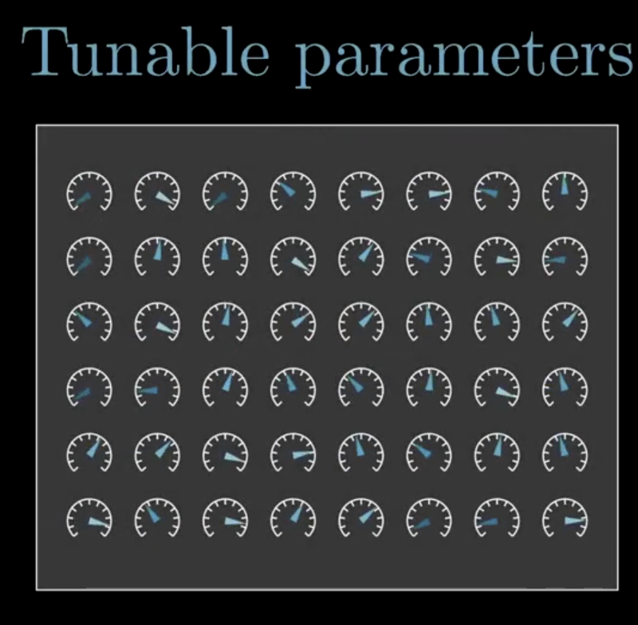

- the idea of **machine learning**
	- rather then explicitly defining the logic of how to do *the task* in code,
		- we do this
			- {:height 185, :width 168}
			- create som arbitrary parameters. tune these parameters *somehow* (black box) on many examples of waht the output should look like for given input — to mimic this behaviour.